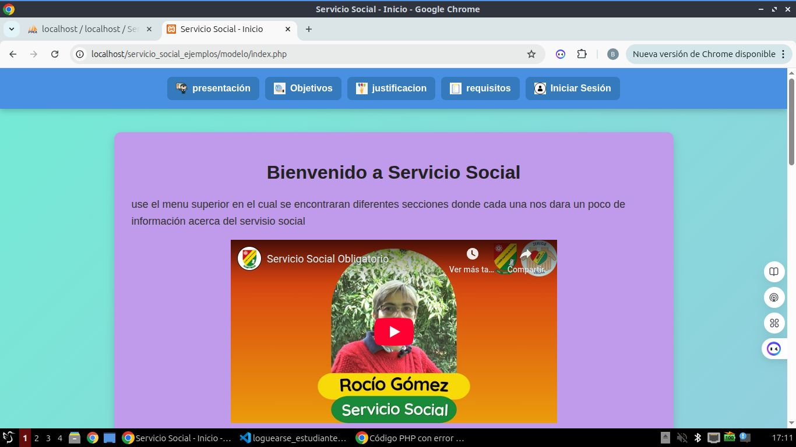
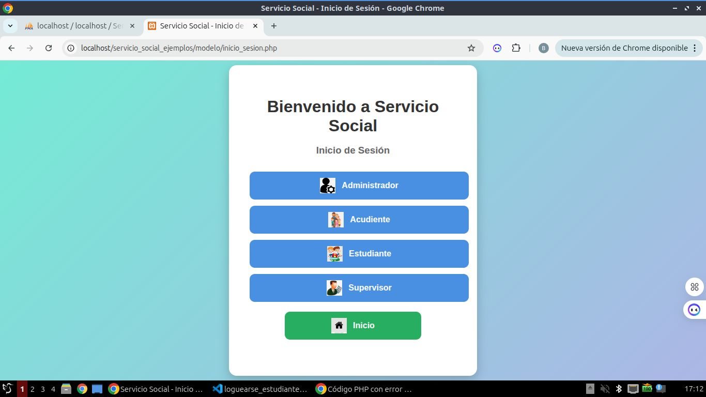
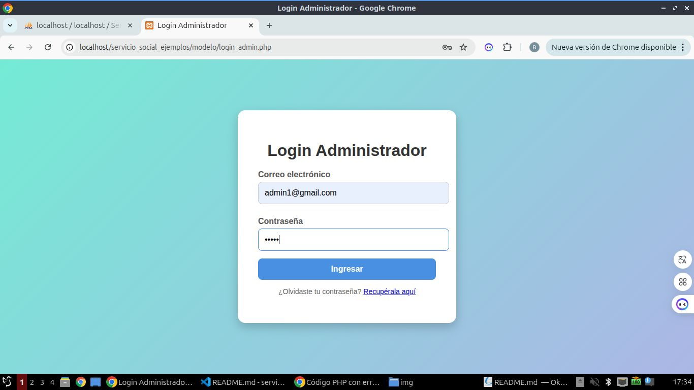
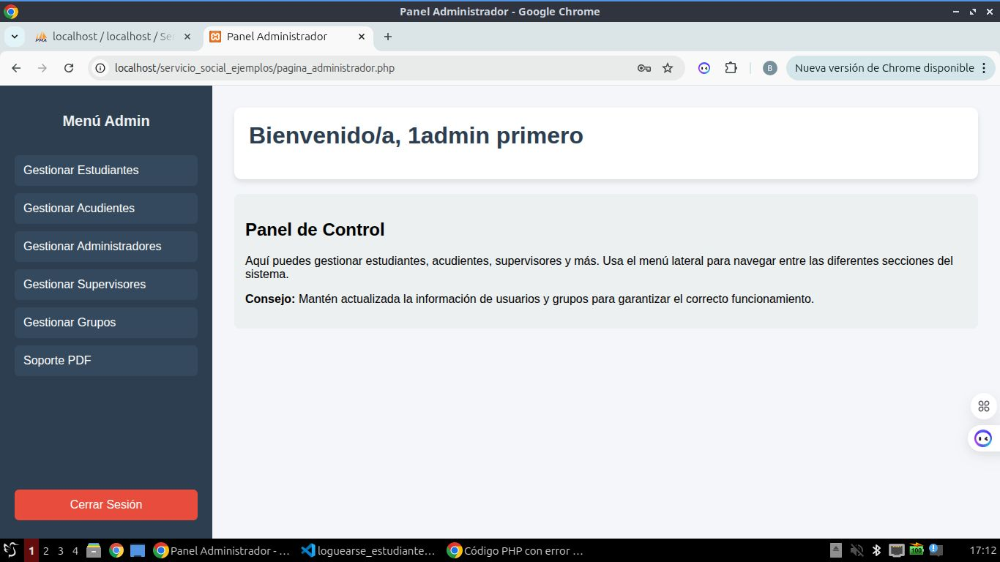
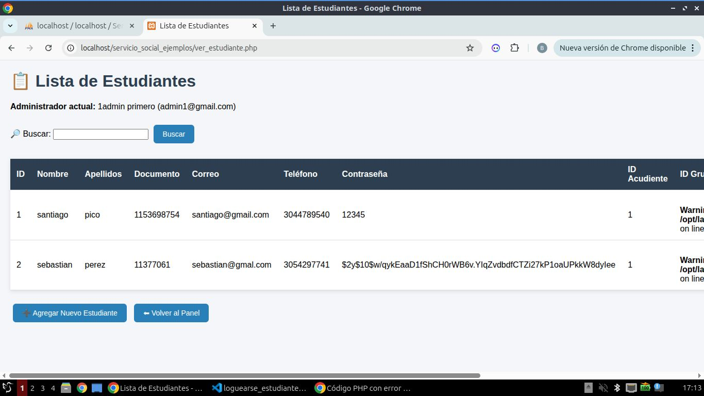
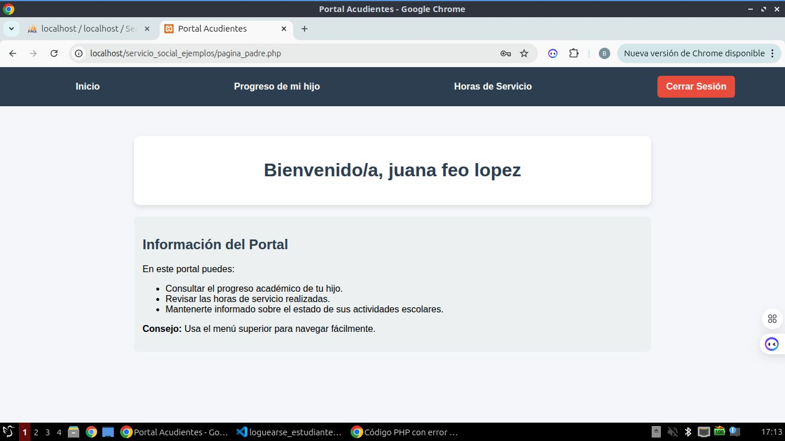
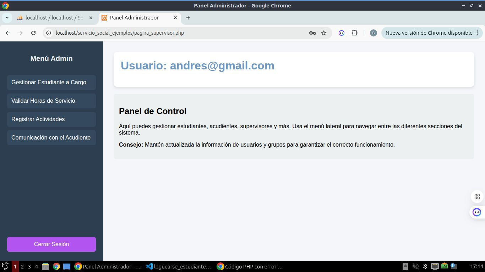

# servicio_social_ejemplos
<h3>Este es el inicio de mi proyecto en el cual tenemos un poco de informacion del servicio social y un boton de inicio de sesion</h3>

 
<h3>Aca tenemos un inicio de sesion por roles donde cada rol tiene su respectivo formulario para poner su correo y contraeña</h3>

<h3>Esta forulario permite que cada rol tenga su respectivo inicio de sesion seguro</h3>

 
<h3>Aca tenemos la pagina de los administradores en la cual se gestiona el funcionamiento de agregar nuevos estudiante, padres, acudientes y supervisores </h3>

 
<h3>Aca tenemos un ejemplo del gestionamiento de los estudiantes</h3>

 
<h3>Aca tenemos la tabla en donde se administran los estudiantes que se han agregado</h3>

 
<h3>Aca tenemos la pagina para padres donde administraran las horas que llevan sus hijos y otras opciones</h3>

 
<h3>Esta pagina perminira a los supervisores dar validacion de ls horas que hacen los estudiantes y tambien solicitar estudiantes</h3>

